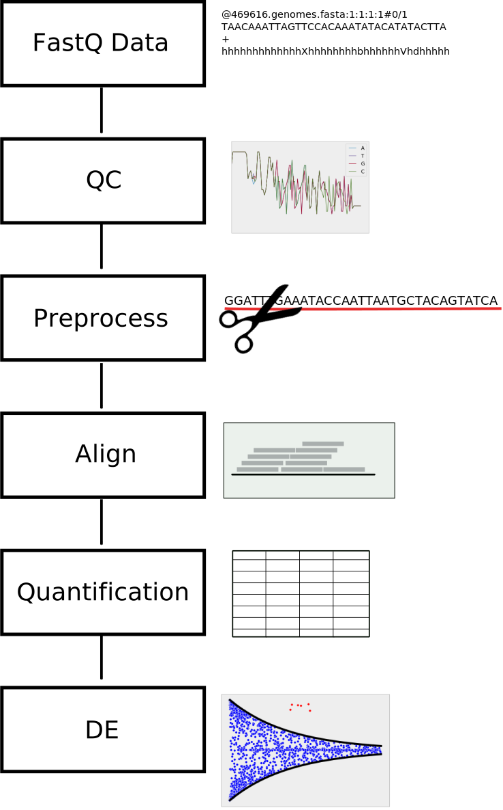



### Overview

This page gives guidelines and tutorials for different components of an RNA-seq analysis. To get straight into the analysis, check out one of our workflows, or to learn more about the best practices for each step, have a look at the guides below.

0. [Data](#data)
1. [QC](#qc)
2. [Preprocessing](#preprocessing)
3. [Alignment](#alignment)
4. [Quantification](#quantification)
5. [Differential expression](#differential-expression)

#### Workflows

- [Fry lab RNASeq pipeline v1.0](workflows/frylab_v1.0.html)
- [TGAC RNASeq pipeline v1.0]()
- [NGLess v1.2](workflows/rnaseq_expression/ngless_1.2.html)

### Data

- [Medata best practice guidelines]()
- [Sample metadata file template]()

### QC
- [QC interpretation guide]()
- [List of QC tools]()

### Preprocessing
- [Identifying and removing low quality reads]()
- [Triming adapters](http://genomicsadventures.wordpress.com/2013/05/02/trimming-illumina-sequencing-adapters/)

### Alignment
- [Tophat alignment protocol](http://www.ncbi.nlm.nih.gov/pubmed/22383036)

### Quantification
- [Best practices for counting reads]()
- [Available software]()

### Normalization
- [NGS best practice overview for beginners](http://biorxiv.org/content/early/2014/06/19/006403)

### Differential expression
- [Differential expression analysis with DEseq](http://bioconductor.org/packages/release/bioc/vignettes/DESeq/inst/doc/DESeq.pdf)
